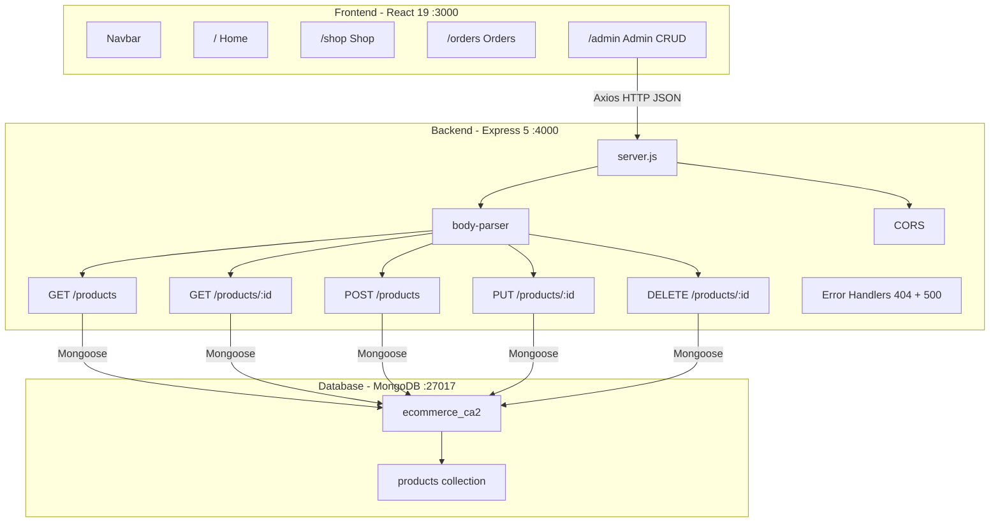
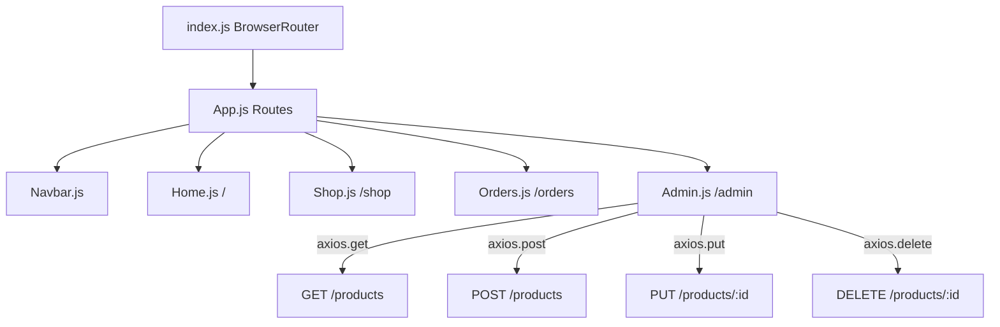
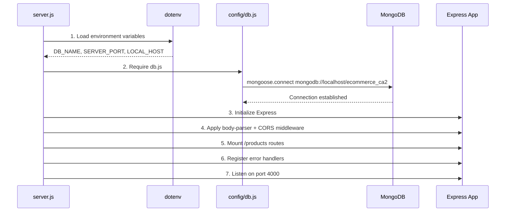
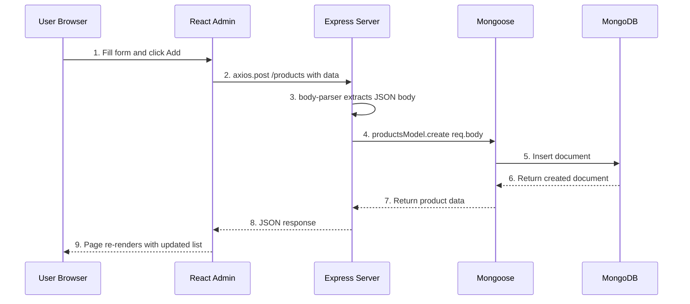
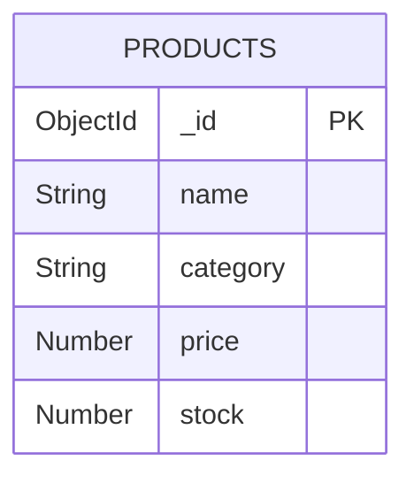
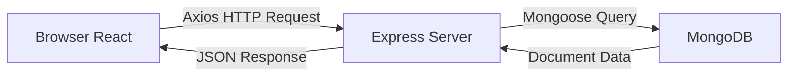

# Ecommerce CA2 - Full Stack Application

A full-stack ecommerce web application built with React, Express, and MongoDB (MERN stack). The app features a product catalog, shopping cart, order tracking, and an admin panel for managing products.

---

## Table of Contents

- [Architecture Overview](#architecture-overview)
- [Infrastructure Diagram](#infrastructure-diagram)
- [Tech Stack](#tech-stack)
- [Project Structure](#project-structure)
- [How It All Works Together](#how-it-all-works-together)
- [Prerequisites](#prerequisites)
- [Getting Started](#getting-started)
- [API Endpoints](#api-endpoints)
- [Frontend Pages](#frontend-pages)
- [Database Schema](#database-schema)
- [Environment Variables](#environment-variables)

---

## Architecture Overview

This is a **MERN stack** application with three main layers:

1. **Frontend (Client)** - React single-page application running on port `3000`
2. **Backend (Server)** - Express REST API running on port `4000`
3. **Database** - MongoDB running on port `27017`

The frontend sends HTTP requests (via Axios) to the backend API. The backend uses Mongoose to interact with MongoDB and returns JSON responses back to the frontend.

---

## Infrastructure Diagram

### Full Stack Architecture



### Frontend Component Tree



### Backend Startup Sequence



### Request Flow - Create Product Example



### Database Schema



---

## Tech Stack

| Layer         | Technology         | Version  | Purpose                          |
|---------------|--------------------|----------|----------------------------------|
| Frontend      | React              | 19.2.4   | UI components and rendering      |
| Routing       | React Router DOM   | 7.13.0   | Client-side page navigation      |
| HTTP Client   | Axios              | 1.13.6   | API calls to the backend         |
| Backend       | Express            | 5.2.1    | REST API server                  |
| ODM           | Mongoose           | 9.2.3    | MongoDB object modeling          |
| Database      | MongoDB            | —        | NoSQL document storage           |
| Auth (future) | JWT + bcryptjs     | 9.0.3    | Token auth and password hashing  |
| Dev Server    | Nodemon            | 3.1.14   | Auto-restart on file changes     |

---

## Project Structure

```
ecommerce-ca2/
│
├── client/                          # React Frontend
│   ├── public/                      # Static assets (index.html, icons)
│   ├── src/
│   │   ├── pages/
│   │   │   ├── Home.js              # Landing page with hero and featured products
│   │   │   ├── Shop.js              # Product catalog with shopping cart
│   │   │   ├── Orders.js            # Order history display
│   │   │   ├── Admin.js             # Product management (CRUD operations)
│   │   │   └── Home.css             # Styles for all pages
│   │   ├── components/              # Reusable components (future use)
│   │   ├── context/                 # React context (future use)
│   │   ├── hooks/                   # Custom hooks (future use)
│   │   ├── utils/                   # Utility functions (future use)
│   │   ├── App.js                   # Main app with route definitions
│   │   ├── Navbar.js                # Navigation bar component
│   │   └── index.js                 # React entry point (BrowserRouter)
│   ├── package.json                 # Frontend dependencies
│   └── README.md                    # This file
│
├── server/                          # Express Backend
│   ├── config/
│   │   ├── db.js                    # MongoDB connection setup
│   │   └── .env                     # Environment variables
│   ├── models/
│   │   └── products.js              # Product Mongoose schema
│   ├── routes/
│   │   └── products.js              # Product CRUD route handlers
│   ├── middleware/                   # Custom middleware (future use)
│   ├── server.js                    # Express app entry point
│   └── package.json                 # Backend dependencies
│
└── package.json                     # Root package.json
```

---

## How It All Works Together

### 1. Database Layer (MongoDB + Mongoose)

MongoDB stores data as JSON-like documents in collections. The `products` collection holds all product data.

**Mongoose** acts as the bridge between the Express server and MongoDB. It provides:
- A **schema** (`models/products.js`) that defines the shape of product documents
- **Methods** like `.find()`, `.create()`, `.findByIdAndUpdate()`, `.findByIdAndDelete()` to query the database

The database connection is established in `config/db.js` when the server starts:
```
mongoose.connect("mongodb://localhost/ecommerce_ca2")
```

### 2. Backend Layer (Express)

The Express server (`server.js`) is the middleman between the frontend and database. When it starts up, it:

1. **Loads environment variables** from `config/.env` using `dotenv`
2. **Connects to MongoDB** by requiring `config/db.js`
3. **Sets up middleware**:
   - `body-parser` — parses incoming JSON request bodies
   - `cors` — allows the frontend (port 3000) to make requests to the backend (port 4000)
4. **Mounts routes** — the `/products` routes are defined in `routes/products.js`
5. **Handles errors** — catches 404 (not found) and 500 (server error) responses

The route file (`routes/products.js`) defines five REST API endpoints that map to Mongoose operations:

| HTTP Method | Endpoint         | Mongoose Method             | Description       |
|-------------|------------------|-----------------------------|--------------------|
| GET         | /products        | `find()`                    | Get all products   |
| GET         | /products/:id    | `findById()`                | Get one product    |
| POST        | /products        | `create()`                  | Add a product      |
| PUT         | /products/:id    | `findByIdAndUpdate()`       | Update a product   |
| DELETE      | /products/:id    | `findByIdAndDelete()`       | Delete a product   |

### 3. Frontend Layer (React)

The React app (`client/src`) handles the user interface. Key parts:

- **`index.js`** — wraps the app in `BrowserRouter` for client-side routing
- **`App.js`** — defines four routes using React Router:
  - `/` → Home page
  - `/shop` → Shop page
  - `/orders` → Orders page
  - `/admin` → Admin page
- **`Navbar.js`** — navigation bar rendered on every page

The **Admin page** (`pages/Admin.js`) is the only page currently connected to the backend. It uses **Axios** to make HTTP requests:

```js
// Fetch all products on page load
axios.get("http://localhost:4000/products")

// Create a new product
axios.post("http://localhost:4000/products", { name, category, price, stock })

// Update a product
axios.put("http://localhost:4000/products/${id}", updatedData)

// Delete a product
axios.delete("http://localhost:4000/products/${id}")
```

### 4. How a Request Flows Through the Stack

The full request-response cycle is shown in the **Request Flow** diagram above. In summary:



**Example — Creating a product:**

1. User fills in the form on the Admin page and clicks "Add"
2. React calls `axios.post("http://localhost:4000/products", productData)`
3. Express receives the request at `POST /products`
4. `body-parser` middleware extracts the JSON body from the request
5. The route handler calls `productsModel.create(req.body)`
6. Mongoose validates the data against the product schema
7. Mongoose sends an insert command to MongoDB
8. MongoDB stores the document and returns it
9. Express sends the created product back as a JSON response
10. React receives the response and refreshes the page to show the updated list

---

## Prerequisites

Before running this application, make sure you have the following installed:

- **Node.js** (v18 or higher) — [Download](https://nodejs.org/)
- **MongoDB** (Community Edition) — [Download](https://www.mongodb.com/try/download/community)
- **npm** (comes with Node.js)

---

## Getting Started

### Step 1: Clone the Repository

```bash
git clone <repository-url>
cd ecommerce-ca2
```

### Step 2: Start MongoDB

Make sure MongoDB is running on your machine:

```bash
# macOS (if installed via Homebrew)
brew services start mongodb-community

# Or run directly
mongod
```

MongoDB should be running on `localhost:27017`.

### Step 3: Install Backend Dependencies

```bash
cd server
npm install
```

### Step 4: Start the Backend Server

```bash
# With auto-reload (recommended for development)
npx nodemon server.js

# Or without auto-reload
node server.js
```

You should see:
```
Connected to port 4000
connected to mongodb://localhost/ecommerce_ca2
```

### Step 5: Install Frontend Dependencies

Open a **new terminal** and run:

```bash
cd client
npm install
```

### Step 6: Start the Frontend

```bash
npm start
```

The React app will open at [http://localhost:3000](http://localhost:3000).

### Quick Reference

| Service  | Command                          | URL                    |
|----------|----------------------------------|------------------------|
| MongoDB  | `brew services start mongodb-community` | `localhost:27017` |
| Backend  | `cd server && npx nodemon server.js`   | `localhost:4000`  |
| Frontend | `cd client && npm start`               | `localhost:3000`  |

> **Note:** All three services (MongoDB, Backend, Frontend) must be running simultaneously in separate terminals for the app to work.

---

## API Endpoints

Base URL: `http://localhost:4000`

| Method | Endpoint         | Body                                      | Response              |
|--------|------------------|-------------------------------------------|-----------------------|
| GET    | /products        | —                                         | Array of all products |
| GET    | /products/:id    | —                                         | Single product object |
| POST   | /products        | `{ name, category, price, stock }`        | Created product       |
| PUT    | /products/:id    | `{ name, category, price, stock }`        | Updated product       |
| DELETE | /products/:id    | —                                         | Deleted product       |

---

## Frontend Pages

| Route     | Component  | Description                                | Backend Connected |
|-----------|------------|--------------------------------------------|-------------------|
| `/`       | Home.js    | Landing page with hero and featured items  | No                |
| `/shop`   | Shop.js    | Product catalog with client-side cart       | No                |
| `/orders` | Orders.js  | Order history table                        | No                |
| `/admin`  | Admin.js   | Full CRUD product management panel         | Yes               |

---

## Database Schema Details

### Products Collection

| Field    | Type     | Description            |
|----------|----------|------------------------|
| `_id`    | ObjectId | Auto-generated by MongoDB |
| `name`   | String   | Product name           |
| `category` | String | Product category (e.g., Fabric, Thread, Needles) |
| `price`  | Number   | Product price          |
| `stock`  | Number   | Quantity in stock      |

---

## Environment Variables

Located in `server/config/.env`:

| Variable      | Value                    | Description                    |
|---------------|--------------------------|--------------------------------|
| `DB_NAME`     | `ecommerce_ca2`          | MongoDB database name          |
| `SERVER_PORT` | `4000`                   | Port the Express server runs on |
| `LOCAL_HOST`  | `http://localhost:3000`  | Allowed CORS origin (frontend) |
